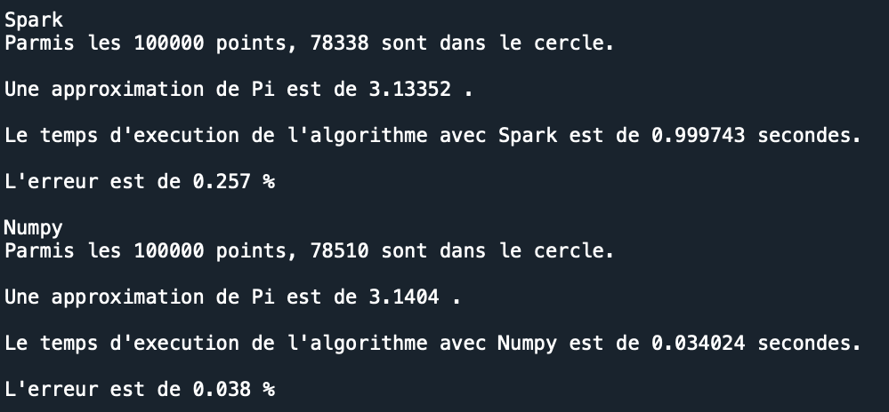
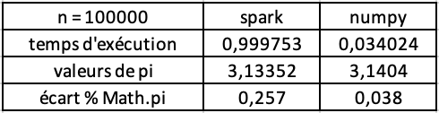
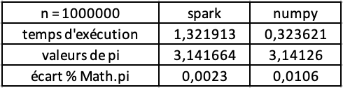

# Pi-Estimator
Ce projet consiste à estimer Pi par le biais de Spark et Numpy et comparer leur temps d'exécution et leur écart à Pi (valeur machine).

# Exécution du programme à partir d'un terminal
  Ouvrir un terminal et tapper les lignes suivantes :
 - git clone https://github.com/NolanCarre/Pi-Estimator.git 
 - cd Pi-Estimator 
 - python Script/pi_estimator.py 
 
# Estimation de Pi
## Sortie obtenue

  
## Avec 100 000 points

## Avec 1 000 000 points

  
## Performances Spark vs. Numpy
Avec n = 100 000 points la méthode utilisant Numpy est à privilégier car plus précise.
En revanche, avec n = 1 000 000 la méthode utilisant Spark sera plus précise.

Dans les deux cas, Numpy permet d'obtenir une vitesse d'exécution plus élevée.

## Remarques
Le choix entre Numpy et Spark doit se faire en fonction des besoins. En particulier, si le nombre de données est élevé il est préférable d'utiliser Spark afin d'accroître la précision. Mais le temps d'exécution sera plus élevé.

Le nombre de points est modifiable dans à la ligne 23 du script pi-estimator.py .

